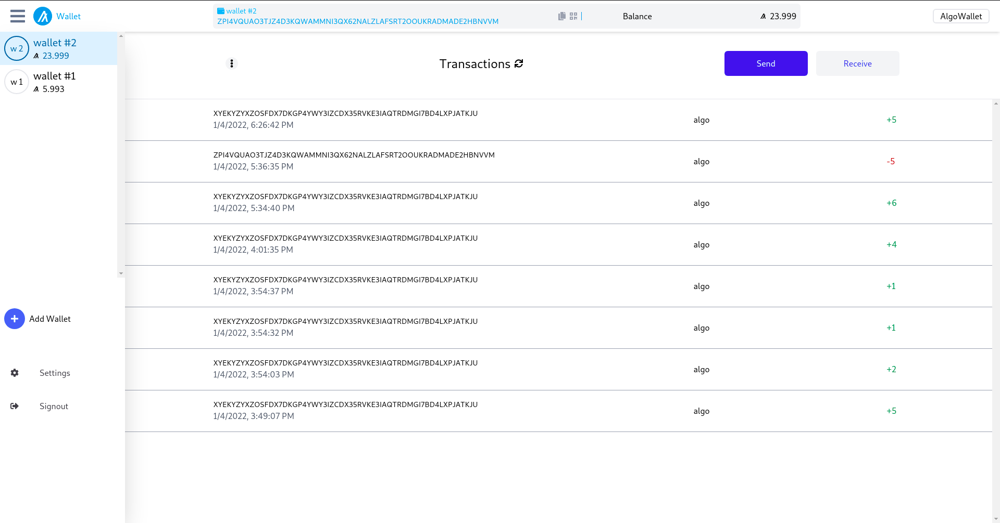

# Algorand Custodial Wallet




> UI/UX based on  [MyAlgo  Wallet](https://wallet.myalgo.com/)
>


# Notice

The project is created for  [gitcoin Tatum Integration Celebration Bounty](https://gitcoin.co/issue/algorandfoundation/grow-algorand/122/100027180#) .

The project is not audited and should not be used in a production environment.


## Table of Contents
- [Tech](#tech)
- [Prerequisite](#prerequisite)
- [Installation](#installation)
- [Usage](#usage)
- [License](#license)


## Tech

- NextJS
- TypeScript
- Prisma
- SQLite
- TailwindCSS
- Redux
- React


## Prerequisite

- NodeJS
- NPM
- git


## Installation

1. Clone the progject

   ```sh
   git clone git@github.com:soheil555/algorand-custodial-wallet.git
   ```

2. cd into the project directory and install dependencies

   ```sh
   cd algorand-custodial-wallet
   npm install
   ```

3. create env file

   ```sh
   cp .env.example .env.local
   ```

 4. edit `.env.local` file and set values for:

    ```sh
    COOKIE_PRIVATE=U87bp4MH9TdF3q56js2bGQ9wDTVhDFhyepxzNRrggxkWB6YA1u #just use a random string. for user session encryption
    TATUM_API_KEY= #get tatum API key from tatum website
    ```

​		 [sign up for Tatum API Key](https://dashboard.tatum.io/sign-up)

​	

 5. create database file

    ```sh
    npx prisma db push
    npx prisma generate
    ```

       

 6. To run development server on `http://localhost:3000` run:

   ```sh
   npm run dev
   ```

 7. For deployment run below commands in order:

   ```sh
   npm run build
   npm run start
   ```

   

## Usage


### Create Wallet


### Copy address to clipboard


### Delete Wallet


### Rename Wallet


### Get Wallet address QRCode


### Send Algo


### Receive Algo


### Change User password


## License

Distributed under the MIT License. See `LICENSE.md`


